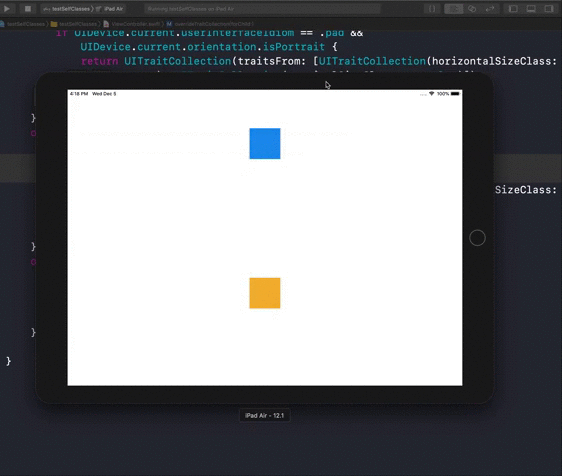

# iPad-Size-Classes-demo


This Demo base on these two tutorial:
[Size classes iPad Portrait/Landscape](https://medium.com/if-let-swift-programming/size-classes-ipad-portrait-landscape-55f59173c65a)
[Xcode 8 的 Size Classes 使用](https://www.jianshu.com/p/e8c87f93dacd)

iPad Portrait and Landscape are both with Regular Width and Regular Height.
Which means it couldn't be different size class like iPhone Portrait and Lanscape.


Now I use if statement to change it's layout
``` swift
if UIDevice.current.userInterfaceIdiom == .pad && UIDevice.current.orientation.isPortrait {
            return UITraitCollection(traitsFrom: [UITraitCollection(horizontalSizeClass: .compact), UITraitCollection(verticalSizeClass: .regular)])
        }

```

It means that if pad is portrait then it will use compact Width and Regular height.


## Demo GIF

